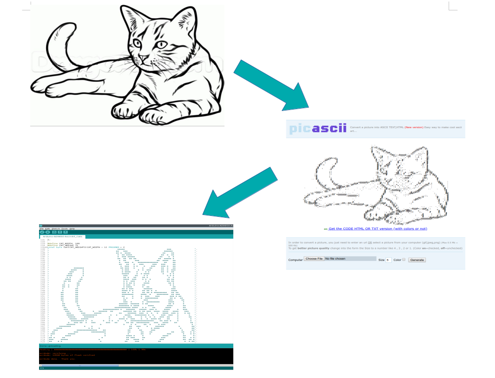
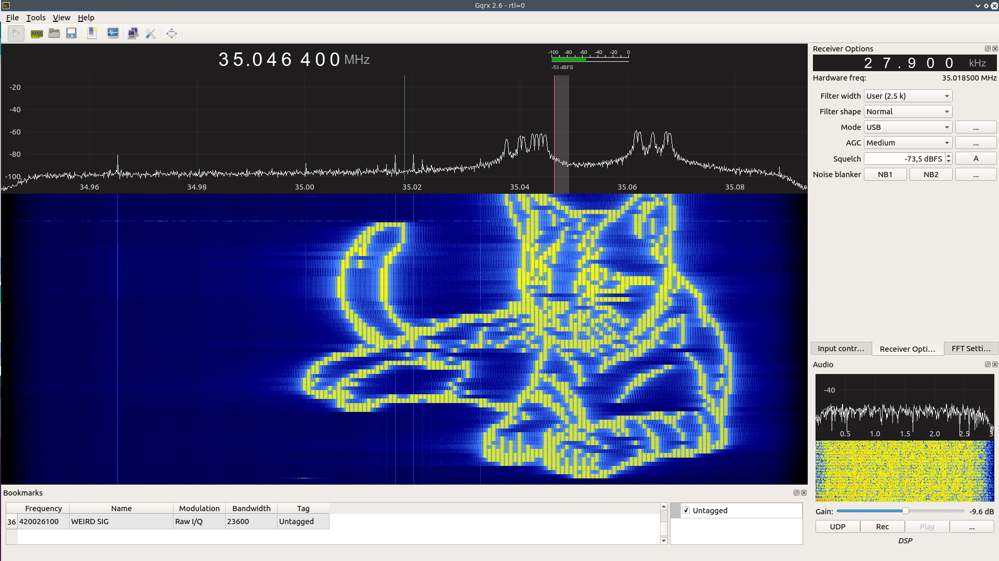

# Arduino RFpainter - Abusing FMCW to Paint Cats on Your Spectrogram
A few years ago, a guy who own github username [drmpeg](https://github.com/drmpeg) wrote a nice gnuradio block which is called [gr-painter](https://github.com/drmpeg/gr-paint). This block works very well and I had some fun with it. Now, I don't have SDR which can transmit anymore, only receive (an el-cheapo RTL SDR dongle) and I want to have do that again, so, I can't. I have some AD9851 DDS modules lying araund, so I decided to implement FMCW version of gr-painter (because I can't figure out how to implement OFDM on DDS module, yet). It won't be as good as gr-painter (which is using OFDM) but i good enough for me. Sure enough the DDS module is controlled using Arduino UNO and some rather simple code.

*Note, FMCW : Frequency Modulated Continuous Wave, OFDM : Orthogonal Frequency Division Multiplexing*

## Requirements
* Arduino UNO
* AD9851 DDS module
* RTL-SDR dongle (to see your RF output)
* GQRX [GitHub repo](https://github.com/csete/gqrx/)
* Breadboard and some jumper wires

## Precaution
**This project will emits Radio waves**. If you don't have any proper radio license, please do this at very low power, don't put any RF power amplifier with it, and do at your own risk!

## Principle of Operation
* Cat picture is stored in the Arduino `PROGMEM` in the form of binary value ASCII art. (white pixel is represented by space and black pixel is represented by alphanumeric)
* This cat ascii-art is stored in the form of 2-dimensional array`[height, width]`.
* This array is scanned from the `[height-1, width-1]` index to `[height-1, 0]`, continue to `[height-2, width-1]` to `[height-2, 0]`, and so on until `[0, 0]`.
* When the element value is space, then the DDS AD9850 is programmed to output very low frequency which we don't care about (in this case, 1 kHz). When the element value is an alphanumeric, then then the DDS AD9850 is programmed to output some RF frequency + some offset, proportional to the width position value.
* Then, FMCW is generated.

The detail of how one can program the AD9851 is presented in the datasheet.

## Arduino UNO to DDS AD9851 connection:
|Arduino UNO |AD9851   |
|:----------:|:-------:|
|8           |RST      |
|9           |DATA     |
|10          |FQ       |
|11          |CLK      |
|5V          |5V       |
|GND         |GND      |

**Very Important**: Don't forget to pull up DDS D0 and D1 pins to 5V thru a 10k resistor and ground DDS D2 pin. Otherwise, the serial programming wouldn't work. (please refer to the datasheet, page 15, figure 18)

## How to Put Your Own Cat (or other pics)
* Prepare your image, which is black and white.
* Convert your image into an Ascii Art using this tool : [http://picascii.com/](http://picascii.com/).
* Put your Ascii-Art in the Arduino Skecth in the form of 2 dimensional array and using `PROGMEM` attribute.
* Write the definitions of your image width and heigth (from the ascii art perspective).
* Call your ascii-art in the `drawCat` function.

## Signal Properties
* Main RF Carrier is at **35.0 MHz** (be cautious, configureable at the `void drawCat(unsigned long in_freq, int scale, int repeat)` function).
* FM Bandwidth is adjustable using parameter `int scale`.
* Scan repetition is alse adjustable using parameter `int repeat`.

## Examples
### Arduino-AD9850-Ascii-Art_Cats
This example will run the drawCat function with the scale = 2 and repeat = 2. Using RTL SDR and GQRX, set the RTL SDR center freq at 35.04 (approx.), FFT size = 32768, rate = 20fps, and Time span = auto.

### Arduino-AD9850-Ascii-Art_Cats-SLOW
This example will run the drawCat function with the scale = 2 and repeat = **20**. Rather usefull to generate more "hi-res" Spectrogram image. Using RTL SDR and GQRX, set the RTL SDR center freq at 35.04 (approx.), FFT size = 32768, rate = 20fps, and Time span = **5min**.

## Acknowledgement
* Ron Economos, [drmpeg](https://github.com/drmpeg) who wrote [gr-painter](https://github.com/drmpeg/gr-paint) for the inspiration.
* Alexandru csete, for the [GQRX](https://github.com/csete/gqrx/)

## Contributing
1. Fork it [https://github.com/handiko/Arduino-RFpainter/fork](https://github.com/handiko/Arduino-RFpainter/fork)
2. Create new branch (`git checkout -b add-blah-blah`)
3. Do some editing / create new feature
4. Commit your works (`git commit -m "Adding some blah blah blah.."`)
5. Push to the branch (`git push -u origin add-blah-blah`)
6. Create a new Pull Request
